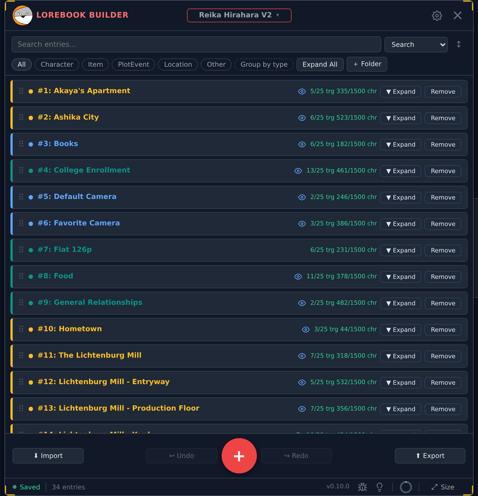

# MKP Lorebook Builder

A browser-based tool for building and managing lorebooks for AI chatbots. No install, no account — open it and start writing.

**[Launch the app](https://mrkingpingus.github.io/MKP-Lorebook-Builder/)**



---

<details>
<summary><strong>What's a Lorebook?</strong></summary>

<!-- paste explanation here -->

</details>

---

## Getting Started

Open the link above... That's it! There's nothing to install or sign in to, so you can just start getting to work by either starting a fresh book or importing an existing one. Your work saves automatically to your browser's local storage as you go, so closing the tab won't lose anything! (But clearing the cache on the host page WILL, so make sure your work is hard saved before doing such a thing or *you **will** cry*.

The entire interface lives inside a single floating window. You can drag it around by its header and resize it from any corner. If it gets out of hand, the **⤢ Size** button in the bottom-right corner has presets and a **Reset to default** option to snap it back. Whatever size you set it to will persist from session to session!

### Getting around the window

Four things frame the app, and it's worth knowing what each is for:

- **The lorebook title, up top.** Click it to open a menu with all your saved lorebooks on the left and import / export on the right. Double-click it to rename the current book.
- **The gear, top right.** Opens Settings directly.
- **The status bar, along the bottom.** Everything that's simply *true* about your work rather than something you do to it: whether it's saved, how many entries you have, how much browser storage you're using, links to report a bug or request a feature, and the **⤢ Size** menu.
- **The pull tab, on the right edge.** Click it to open your lorebook list as a side panel. The window widens to fit it, so the panel appears *beside* your entries rather than covering them.

The hotbar — the row of buttons flanking the **+** — is the other half of that split: it's for things you *do* to your lorebook. You choose what goes in its six slots in Settings.

---

## Building a Lorebook

### Naming Your Lorebook

Double-click the lorebook title at the top of the window and type. The name saves automatically. (A single click opens the lorebook menu instead — see below.)

### Adding Entries

Click the **+** button at the bottom of the window, or press **Alt+N** (configurable in Settings). New entries appear at the bottom of the list.

### Entry Anatomy

Each entry has four parts:

- **Name** — a label for your own reference. Not used by the AI directly.
- **Type** — one of five categories, color-coded on the entry's left border (Types are mostly just for personal organization. As of now, JSON files uploaded to CharSnap won't carry the Entry Type with them. Just something to be aware of!):
  - Purple — Character
  - Blue — Item
  - Red — Plot Event
  - Yellow — Location
  - Teal — Other
- **Triggers** — These are the keywords that the LLM is using to decide to pull from the Lorebook. These are not case sensitive, plural/singular sensitive, or possessive sensitive. You want these to be words that, when they appear in chat, they call upon this entry for context. The contents of user's last message and char's message before that are used for these triggers to determine char's next response. Try not to use the same keywords for more than a handful of entries. Each trigger is its own chip. You can add them one at a time, paste a comma-separated list to add several at once, or use the Phrase Builder to click words together from the entry's description. Up to 25 triggers per entry.
- **Description** — This is the meat of the entry. Generally, you want to keep this concise. Character limit is 1500 for each entry, but it's recommended to keep it around 500, especially because so many entries can be pulled at one time. Some examples of entries can be: character sheets for NPCs, rules of the universe, setting, creatures/monsters, food/drink, etc. The character counter color will change as you approach the limit (thresholds are adjustable in Settings, though stock settings are recommended).

### Trigger Crosstalk

If two or more entries share the same trigger, the conflicting chips are flagged with a warning ring. Hovering the chip opens a popover listing which other entries share it. You can click **Allow** to mark the overlap as intentional — the ring turns blue to confirm it — or **Revoke** to restore the warning.

### Reordering Entries

Drag any entry card up or down to reorder.

### Suggestions

Each entry has a collapsible **Suggestions** tray. Open it to see up to 12 auto-generated trigger keyword suggestions based on the entry's name, type, and description. Click any suggestion to add it as a trigger, or hit the reroll button to generate a fresh batch.

  - **Phrase Builder**

Inside the Suggestions tray, the **Phrase Builder** lets you click words from the description to assemble a multi-word trigger phrase in order. Confirm to add it as a single trigger chip.

### Undo / Redo

Every change to your entries is tracked. Use **Ctrl+Z** to undo and **Ctrl+Y** to redo, up to 50 steps back. Both hotkeys are configurable in Settings. (Currently a tad overzealous)

---

## Managing Multiple Lorebooks

There are two ways to reach your lorebooks, and they suit different habits:

- **Click the lorebook title** at the top of the window. A menu drops down with every saved book listed alphabetically on the left. Click one to switch to it, or **+ New lorebook** at the foot of the list to start a fresh one.
- **Click the pull tab** on the window's right edge. Same list, but as a side panel that stays open while you work — the window widens to fit it, so nothing you were reading gets covered.

You can save up to 10 lorebooks independently. Each has its own name, entries, and history. Switch between them at any time — your current lorebook autosaves before switching!

The list is alphabetical and stays that way, so a book you use often is always in the same place.

To delete a lorebook, hover its row in the title menu and click the **×** on the right. You'll be asked to confirm. **This cannot be undone**.

---

## Search & Filter

### Search

The search bar filters the entry list in real time across entry names, triggers, and descriptions. Matches are highlighted in yellow inside description fields. The match counter shows how many total matches exist across how many entries. At the very end of tbhe search bar is a button for selecting *how* you'd like to sort your search. You have Default, A-Z, Z-A, and Last Modified. *(Last Modified is great for keeping track of non-linear workflows!)*

Below the search bar, a **Find & Replace** row lets you do a bulk text replacement across every trigger and description field in the lorebook at once.

### Filter by Type

The type filter bar lets you narrow the entry list to one or more types. Click a type pill to toggle it. Active filters stack — you can show Characters and Locations at the same time, for example.

---

## Import & Export

### Import

Click the lorebook title and drop a file onto the drop zone in the right-hand column, or click it to browse. The **Import** button in the hotbar does the same thing in its own window. Supported formats: **JSON**, **TXT**, **DOCX**, and **ODT**.

Prefer to paste? Click **or paste entries instead** next to the drop zone and paste a block of TXT-formatted entries directly.

Once the file is read, you're asked what should happen to the lorebook you have open. All four choices are available wherever you started the import:

| Choice | What happens |
|---|---|
| **Import as new** | The entries go into a brand-new lorebook. Your current one is untouched. |
| **Append** | The entries are added to your current lorebook. |
| **Replace** | Your current lorebook's entries are overwritten. |
| **Back up first** | Downloads a JSON copy of your current lorebook, then replaces it. |

Then you get a preview of every entry about to land, and a banner spelling out what confirming will do. **Back** returns you to the four choices without making you pick the file again.

Autosave has already saved your work at this point — a backup is about keeping a copy *outside* the browser, which is a different thing.

### Export

Both live in the right-hand column of the lorebook title menu.

- **⬇ JSON** — the full lorebook as a `.json` file
- **⬇ TXT** — a plain-text block format
- **⬇ DOCX** — a Word-compatible document
- **⎘ Copy** — copies the full JSON directly to your clipboard

The **File** box above the buttons sets the download filename.

**Templates** — download a blank JSON, TXT, or DOCX file pre-formatted for import, useful if you want to write entries by hand outside the app.

---

## Settings

Click the **gear** in the top-right corner, or press **Ctrl+,**. Settings opens as four collapsed sections, so you pick where you're going rather than scrolling past everything:

| Section | What's in it |
|---|---|
| **Editing & Entries** | Writing aids, character counters, entry badges, entry history |
| **Appearance & Accessibility** | Themes and custom colors, text size, reduced motion, high contrast |
| **Layout & Controls** | Keyboard shortcuts, hotbar slots, FAB menu, folders, reference panel, navigation |
| **System** | Browser storage limit |

There's a **filter box** at the top. Type what you're after — `fab`, `shortcut`, `dark mode`, `storage` — and the panel narrows to just those controls and opens whichever section holds them. It matches words that aren't in the visible label too, so "hotkey" finds **Keyboard shortcuts**.

Some frequently-touched settings:

| Setting | What it does |
|---|---|
| Suggestions collapsed by default | Starts every entry's suggestion tray closed |
| Hide entry stats badges | Hides the trigger count and character count in entry headers |
| Tiered counter colors | Color-codes character counters green → yellow → red by threshold |
| Character count thresholds | Set where yellow and red kick in |
| Hotbar slots | Assign actions to the 6 slots flanking the + button (3 per side) |
| Keyboard shortcuts | Rebind any of the shortcuts listed below |
| Legacy menus | Brings back the old **☰** header menu, with Lorebooks and Import / Export as side panels |

---

## Sizing

Window size, text size, entry height, and the **+** button's size all live in one place: the **⤢ Size** button in the bottom-right corner. Hover it to peek, click it to keep it open.

| Control | What it does |
|---|---|
| Window size | Named presets, or **Custom…** to type exact dimensions. **Save as default** makes the current size the one **Reset to default** returns to. |
| Text size | Scales all text. Also in Settings → Appearance & Accessibility, since it's an accessibility setting — change it in either place and the other follows. |
| Entry height | How tall entry headers are drawn |
| FAB size | Size of the **+** button |

**Reset all sizing** puts the window, entry height, and FAB back to normal. It deliberately leaves your text size alone.

---

## Keyboard Shortcuts

Press **?** at any time for a cheat sheet inside the app. Every shortcut here is rebindable in Settings → Layout & Controls, and the cheat sheet has a link straight to the editor.

| Shortcut | Action |
|---|---|
| Alt+N | New entry |
| Ctrl+Z | Undo |
| Ctrl+Y | Redo *(Ctrl+Shift+Z also works)* |
| Alt+S | Toggle select mode |
| Alt+A | Expand / collapse all |
| Alt+V | Select all visible |
| Alt+D | Deselect all |
| / | Focus search |
| Alt+H | Focus find & replace |
| Alt+R | Toggle reference panel |
| Alt+W | Swap reference ↔ active *(while paired)* |
| Alt+E | Export |
| Alt+I | Import entries |
| Ctrl+, | Open settings |
| ? | This cheat sheet |
| Escape | Dismiss / cancel |

On macOS, **Ctrl** shortcuts use **Cmd** instead.

---

## Running It Yourself

You don't need to do any of this to *use* the app — the link at the top is the whole product. This section is for anyone who wants to run it on their own machine or host their own copy.

### What you need first

- **[Node.js](https://nodejs.org/)** — version **20.19 or newer**, or **22.12 or newer**. Vite 7 won't run on anything older. Check what you have with `node --version`.
- **npm** — comes bundled with Node, nothing extra to install.
- **[Git](https://git-scm.com/)** — only needed for the clone step. You can also download the repo as a ZIP from GitHub and skip it.

There is no database, no server, and no API key to set up. Nothing to configure before the first run.

### Getting it running

```bash
git clone https://github.com/MrKingPingus/MKP-Lorebook-Builder.git
cd MKP-Lorebook-Builder
npm install
npm run dev
```

`npm run dev` prints a local address — usually **http://localhost:5173** — open that in your browser and the app is live. Edits to files under `src/` reload in the browser instantly.

Press **Ctrl+C** in the terminal to stop the server.

### The other commands

| Command | What it does |
|---|---|
| `npm install` | Downloads dependencies into `node_modules/`. Run once after cloning, and again whenever `package.json` changes. |
| `npm run dev` | Starts the development server with hot reload on port 5173. This is the one you want day to day. |
| `npm run build` | Compiles a production bundle into `dist/`. That folder is plain static files — it can be hosted anywhere. |
| `npm run preview` | Serves the contents of `dist/` on port 4173 so you can check the real production build. Run `npm run build` first. |
| `npm run verify` | Runs the automated browser checks. Optional — see below. |

### Where your data lives

Everything you create runs entirely in your browser and is stored in that browser's `localStorage`. Nothing is uploaded anywhere and no account exists. A local copy keeps its own separate storage from the hosted version, so lorebooks you made on the live site won't appear in your local one — move them across with Export and Import.

### Running the automated checks (optional)

`npm run verify` drives the real app in a headless browser to check features end to end. It needs a Chromium build that Playwright can find, which is a one-time extra install:

```bash
npx playwright install --with-deps chromium
npm run verify
```

A full run launches a fresh browser per scenario and takes several minutes. To run just a slice of it, pass a name substring:

```bash
npm run verify -- folders
```

See `verify/README.md` for what the suite covers.

### Hosting your own copy

Push to `main` and `.github/workflows/main.yml` builds the app and deploys it to GitHub Pages. Two things to know:

1. **Pages has to be turned on first.** In your repository, go to **Settings → Pages** and set the source to **GitHub Actions**. Until you do, the workflow runs, notices Pages is off, and exits cleanly without deploying — so a green check doesn't necessarily mean a live site.
2. **The base path takes care of itself.** `vite.config.js` reads the repository name from the Actions environment, so the build works under `https://<user>.github.io/<repo-name>/` no matter what the repository is called. You don't need to edit anything after forking or renaming.

For any other host, run `npm run build` and upload the `dist/` folder. It's static — no Node runtime required on the server.
