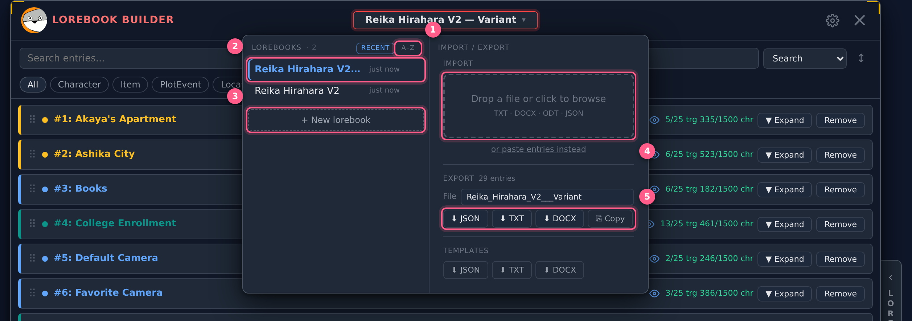
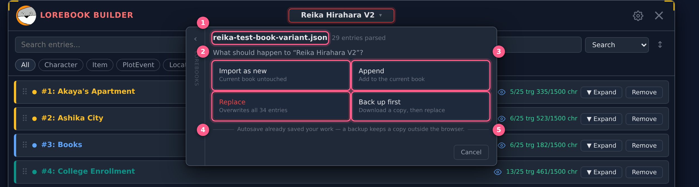
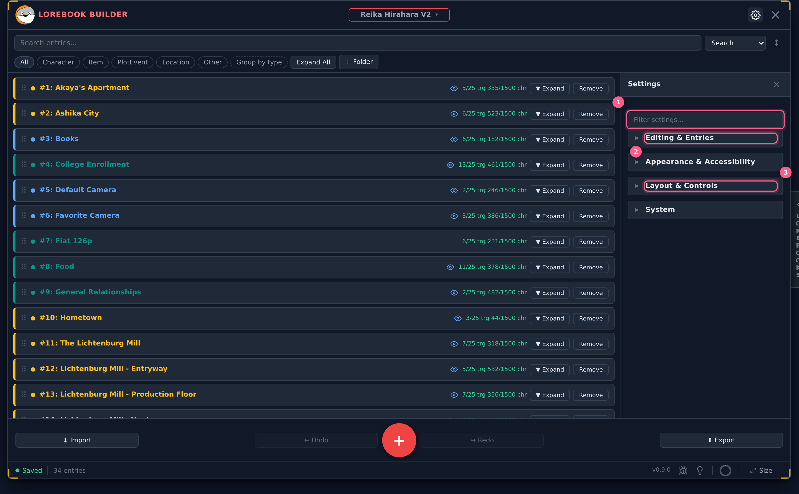
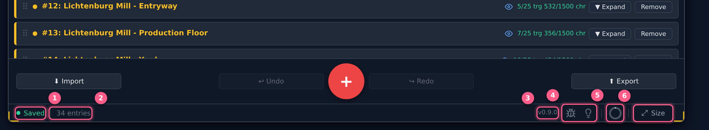
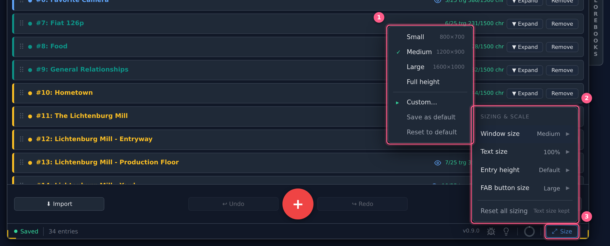
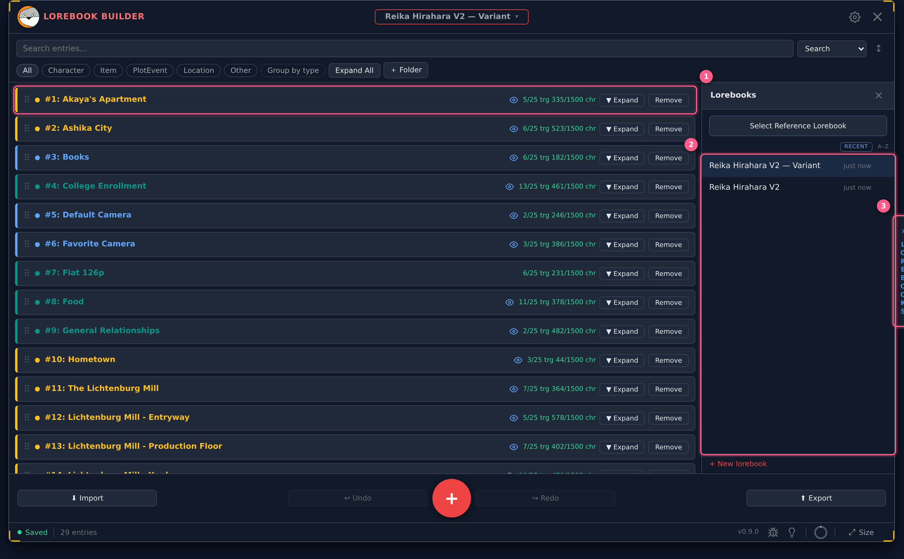

# What's changed in 0.9.0 — the interface overhaul

A tour of the largest UI pass the builder has had. Nothing about your lorebooks
has changed: same data, same file formats, same storage. This is entirely about
where the controls live and how you get to them.

**The short version.** The window header has been emptied out down to the
essentials. The lorebook title is now a menu that carries your books and your
import/export. The hamburger is a gear that opens Settings in one click.
Everything that's a *readout* rather than an *action* moved to a new status bar
along the bottom, including a single menu for every size setting. Settings went
from six sections to four and gained a filter box. And there's a pull tab on the
right edge that opens your lorebook list beside your entries.

If you'd rather have the old menus back, there's a setting for that — see
[Coming from the old layout](#coming-from-the-old-layout) at the end.

---

## The idea behind it

Two rules decide where any control lives now, and they explain most of what
follows:

- **The hotbar is for things you *do* to your lorebook** — add, undo, import,
  export. It was always this, and it hasn't changed.
- **The status bar is for things that are simply *true*** — whether you're
  saved, how many entries you have, how much storage you're using, how big
  everything is drawn.

Anything that isn't an action on your content should not be competing for space
with the actions. That's why the header emptied out.

---

## The header

The header used to hold eight things — logo, name field, entry count, Switch,
feedback icons, storage ring, hamburger, close. It now holds four: the logo, the
lorebook title, a gear, and close.

Everything that left is still here — it moved to the status bar at the bottom of
the window, which is covered further down.

---

## The lorebook title is a menu

1. Most recently opened first — switch to **A–Z** if you'd rather find them by name
2. Every lorebook you've saved; the one you're in is highlighted
3. Start a new lorebook
4. Drop a file here to import, or click to browse
5. Download this book as JSON, TXT or DOCX

Click the title and a menu drops down in two columns.

**On the left: every lorebook you've saved.** Click one to switch to it. The
active book is marked. **+ New lorebook** sits at the foot of the list. To delete
one, hover its row and click the **×** — you'll be asked to confirm first.

**The list is ordered by what you opened most recently**, because the book you
want next is usually the one you were just in. If you'd rather hunt by name, the
**A–Z** toggle in the list header switches it, and it stays switched. Either way
the order is fixed while the menu is open — it can't reshuffle under your cursor
as you reach for a row.

**On the right: import and export.** Drop a file, download in any format, grab a
blank template. All of it without opening a panel somewhere else.

### Three ways it behaves

- **Hover** and the menu surfaces on its own. Move away and it goes.
- **Click** and it pins open until you click again.
- **Double-click** and the title becomes an editable field so you can rename the
  book.

The hover-and-pin behaviour is the same as the `⤢ Size` button in the status bar,
so the two controls that open menus both work the same way.

Renaming moved to a double-click because the title used to be a permanently live
text field — easy to edit by accident, and a poor thing to click when what you
wanted was a menu.

---

## Importing

1. The file you picked, and how many entries it holds
2. **Import as new** — your current book is untouched
3. **Append** — adds those entries to the book you're in
4. **Replace** — overwrites what's there now
5. **Back up first** — downloads a copy, then replaces

Drop a file onto the title menu and the lorebook list slides aside so the import
gets the whole panel. Nothing opens anywhere else.

Then you get a preview of every entry about to land, and a banner spelling out
exactly what confirming will do. **Back** returns you to the four choices without
making you pick the file again.

### The part that actually changed

**All four choices are now available wherever you start an import.** They weren't
before, and the inconsistency was invisible until it bit you:

- The old side panel had the backup option, but couldn't take pasted text.
- The old hotbar Import had pasted text, but no backup option — and it made you
  pick *paste / entries from a file / whole book* before you'd even chosen a file.

Which surface you happened to open decided what you were allowed to do. Both now
run the same flow, so it doesn't matter where you start.

**Pasted entries can do anything a file can.** Paste used to only ever append to
the open book. It reaches all four choices now, and lives behind an **or paste
entries instead** link next to the drop zone.

**Backups are always JSON.** You could previously choose TXT, which is a lossy
format — it doesn't carry your triggers. That's a bad thing to discover about a
backup *after* you've overwritten the original.

---

## Settings

1. Finds a control even if you don't know its exact name
2. What happens as you write
3. How you drive the app — shortcuts, hotbar, folders

The gear in the top-right opens Settings directly — no dropdown in between.
**Ctrl+,** does the same.

It opens as **four collapsed sections**, so you see four headings and nothing
else rather than a wall of controls to scroll past:

| Section | What's in it |
|---|---|
| **Editing & Entries** | Writing aids, counters, entry badges, entry history |
| **Appearance & Accessibility** | Themes and custom colours, text size, reduced motion, high contrast |
| **Layout & Controls** | Keyboard shortcuts, hotbar, FAB menu, folders, reference panel, navigation |
| **System** | Browser storage limit |

This replaces six sections that had grown up around whichever feature happened to
introduce each setting. Nothing changed meaning or default — things are just
where you'd look for them. Inside each section, labelled runs (*Writing aids*,
*Counters*, *Entry badges*) break a long list into a few short ones.

### The filter box

Type what you're after and the panel narrows to those controls, opening whichever
section holds them.

It matches words that **aren't in the visible label**, which is the whole reason
it's useful: "hotkey" finds **Keyboard shortcuts**, "dark mode" finds the theme
picker. Extra words narrow rather than widen, so `storage safari` is more
specific than `storage`. It stays pinned to the top while you scroll.

---

## The status bar

1. Whether your work is saved, and how long ago
2. How many entries this lorebook holds
3. Which build you're running — quote this in a bug report
4. Report a bug, or suggest a feature
5. Browser storage in use; click it for a breakdown
6. Every size setting lives here

A thin bar along the bottom of the window, below the hotbar.

- **Save state** — reads **Saved** the moment a save lands, then ages into
  **Saved 4m ago** so you can tell at a glance nothing is stuck. Hover for the
  exact time.
- **Entry count**, and a **hidden count** when you have entries excluded from
  export. Click the hidden count to manage them.
- **Version** — which build you're on. It sits beside the bug-report link on
  purpose: the one moment it matters is when you're about to file a report.
- **Report a bug / request a feature** — the two icons.
- **Storage ring** — how much of your browser's storage the app is using. Hover
  for a summary, click for a full breakdown.
- **`⤢ Size`** — every sizing control, covered next.

---

## One menu for every size setting

1. Named presets, or **Custom…** to type exact numbers
2. Each row shows what it's set to without opening anything
3. Hover to peek at the menu, click to keep it open

Window size, text size, entry height and the **+** button's size used to be
scattered across three different Settings sections. They're all in the `⤢ Size`
button in the bottom-right corner now, each showing its current value so you can
read your settings without opening anything.

| Control | Notes |
|---|---|
| **Window size** | Named presets, or **Custom…** to type exact numbers. **Save as default** makes the current size what **Reset to default** returns to. |
| **Text size** | Also stays in Settings → Appearance & Accessibility, because that's where people who rely on it look. Change it in either place and the other follows. |
| **Entry height** | How tall entry headers are drawn. |
| **FAB size** | Size of the **+** button. |

**Reset all sizing** puts the window, entry height and FAB back to normal. It
deliberately **leaves your text size alone** — that's an accessibility setting
you may be depending on, and wiping it from a general reset would be hostile.

The button surfaces on hover and pins on click, same as the lorebook title. A
pinned button is outlined so you can tell which mode you're in.

---

## The pull tab

1. Your entries keep their width — the window grew to make room
2. Your lorebooks, beside your entries rather than over them
3. The tab rides the window's edge; click it to open or close the panel

There's a tab on the right edge of the window. Click it and your lorebook list
opens as a side panel.

The important bit: **the window widens to fit the panel** rather than the panel
taking space from your entries. Your list stays exactly as wide as it was, and
nothing you were reading gets covered. Click the tab again to tuck it away.

The tab sits on the *outside* of the window frame, so your entry rows run all the
way to the border. The window stops just short of the screen edge to leave the tab
somewhere to sit, so it can't be pushed off-screen even at full size.

Opening and closing eases rather than snapping, and your entry list holds
perfectly still while it happens.

---

## Smaller things

- **The default window is much bigger — 1200×900, up from 760×620.** The old one
  was cramped, especially with the reference panel open. If you never picked a
  size of your own, yours updates automatically. If you did, your choice is left
  exactly as you set it.
- **"Entry header" is now "Entry height"**, which reads better.
- **The `?` cheat sheet** lists every shortcut, and its *Edit shortcuts* link
  goes straight to the keybinding editor in its new home.
- **There's a *What's new* panel on the home screen**, and a one-time notice when
  you come back after an update. Both offer a click-through tour of the
  screenshots above — the same images, annotated, inside the app.

---

## Coming from the old layout

**Nothing about your data changed.** Same lorebooks, same entries, same JSON, same
browser storage. You don't need to export or re-import anything.

**Where things went:**

| If you're looking for | It's now |
|---|---|
| The **☰** menu | A gear, opening Settings directly |
| The **Lorebooks** tab | The lorebook title menu, or the pull tab |
| The **Import / Export** tab | The right column of the lorebook title menu |
| Renaming a lorebook | Double-click the title |
| Switching lorebooks | The title menu, or the pull tab |
| Default window size · FAB size · entry height | The `⤢ Size` menu |
| Keyboard shortcuts in Settings | Settings → Layout & Controls, at the top |
| Entry count · storage ring · feedback links | The status bar along the bottom |

**Want the old menus back?** Settings → Layout & Controls → Navigation → **Legacy
menus**. Turning it on restores the **☰** header menu with Lorebooks, Import /
Export and Settings as side panels. Those panels never went away — the setting
only decides whether the header offers a route to them.

**On phones**, none of this has landed yet. The status bar, the title menu and the
pull tab are desktop-only for now; the phone layout has its own pass coming, since
it has different constraints and deserves a proper look rather than a squeezed
version of the desktop answer.
